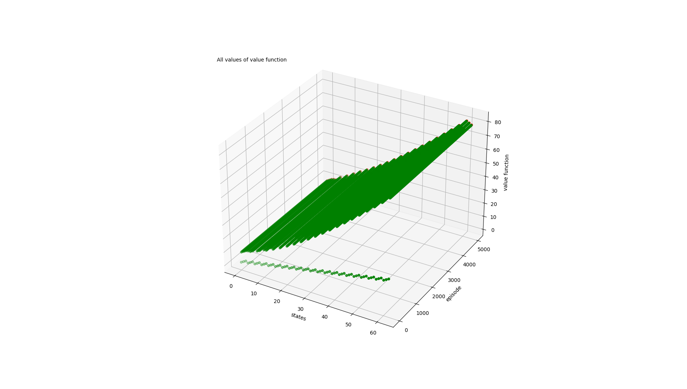
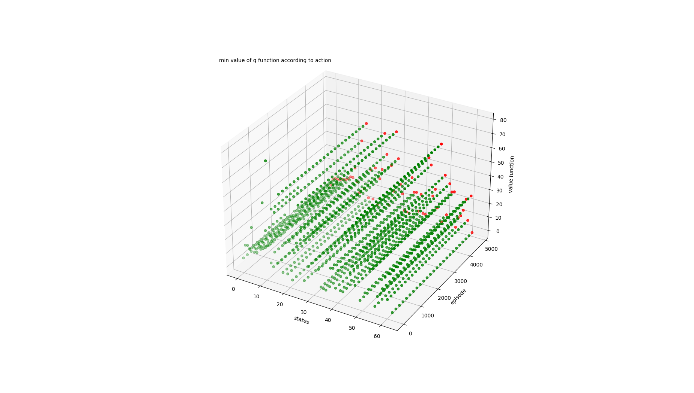
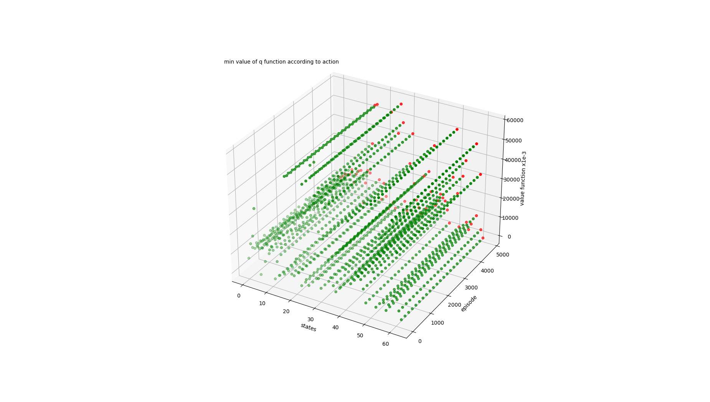

# User Guide

# Explanation and structure

# Simulation results

There is 3 algorithms of reinforcement learning that were impelemented: value_iteration, q_learning and sarsa. The considered system is a dynamic cloud ressources allocation. 

---

## Used parameters are:
1. ***Modelisation parameters***
    * **b = 20** (queue capacity) 
    * **k = 3** (maximum vm number)
    * **d = 1** (vm flow)
    * **l = 2** (maximum client arrivals per time unit)
    * **cf = 1** (cost of vm running)
    * **ca = 1** (cost of vm activation)
    * **cd = 1** (cost of vm deactivation)
    * **ch = 1** (cost of client in the queue)
    * **pa** (arrivals probability distribution)
2. ***Learning parameters***
    * **episodes = 5000** (number of episodes)
    * **max_game_steps = 70** (max number of actions to do before restart)
    * **discount = 0.8** (a discount used to learning)
    * **eps = 0.2** (eps used for eps-greedy)
    * **alpha = 0.6** (used in sarsa algorithm)

---

## Results

**Notes:**
1. The plot represent the evolution(during the time/episodes) of q-function or value-function for each state.
2. The policy shows how many vm you must activate when you have m clients in the queue and n vm active **(m,n)**

### **value_iteration**

We are optimising the value function. As a system is not very complex, value function is converging very fast(see the plot). The value function is much bigger for higher states (with multiple clients in the queue).

  
uniform distribution

  
### best policy

In state (0, 1) do: 1.0

In state (0, 2) do: 1.0

In state (0, 3) do: 1.0

In state (1, 1) do: 1.0

In state (1, 2) do: 2.0

In state (1, 3) do: 2.0

In state (2, 1) do: 2.0

In state (2, 2) do: 2.0

In state (2, 3) do: 3.0

In state (3, 1) do: 2.0

In state (3, 2) do: 2.0

In state (3, 3) do: 3.0

In state (4, 1) do: 2.0

In state (4, 2) do: 2.0

In state (4, 3) do: 3.0

In state (5, 1) do: 3.0

In state (5, 2) do: 3.0

In state (5, 3) do: 3.0

In state (6, 1) do: 3.0

In state (6, 2) do: 3.0

In state (6, 3) do: 3.0

In state (7, 1) do: 3.0

In state (7, 2) do: 3.0

In state (7, 3) do: 3.0

In state (8, 1) do: 3.0

In state (8, 2) do: 3.0

In state (8, 3) do: 3.0

In state (9, 1) do: 3.0

In state (9, 2) do: 3.0

In state (9, 3) do: 3.0

In state (10, 1) do: 3.0

In state (10, 2) do: 3.0

In state (10, 3) do: 3.0

In state (11, 1) do: 3.0

In state (11, 2) do: 3.0

In state (11, 3) do: 3.0

In state (12, 1) do: 3.0

In state (12, 2) do: 3.0

In state (12, 3) do: 3.0

In state (13, 1) do: 3.0

In state (13, 2) do: 3.0

In state (13, 3) do: 3.0

In state (14, 1) do: 3.0

In state (14, 2) do: 3.0

In state (14, 3) do: 3.0

In state (15, 1) do: 3.0

In state (15, 2) do: 3.0

In state (15, 3) do: 3.0

In state (16, 1) do: 3.0

In state (16, 2) do: 3.0

In state (16, 3) do: 3.0

In state (17, 1) do: 3.0

In state (17, 2) do: 3.0

In state (17, 3) do: 3.0

In state (18, 1) do: 3.0

In state (18, 2) do: 3.0

In state (18, 3) do: 3.0

In state (19, 1) do: 3.0

In state (19, 2) do: 3.0

In state (19, 3) do: 3.0

In state (20, 1) do: 3.0

In state (20, 2) do: 3.0

In state (20, 3) do: 3.0

---

### plot

  
pa = [0.1, 0.3, 0.6]

  
### best policy

### plot

### **q_learning**

We are optimising the q-function, sometimes taking random action(eps-greedy). As we execute multiple actions per "game" and we restart the "game" each time we loose or we make max_game_steps actions, we update q-function. As we see on the plot, there is some state that are undicsovered(high states with multiple clients in the queue). 

  
uniform distribution

  
### best policy

In state (0, 1) do: 1

In state (0, 2) do: 2

In state (0, 3) do: 1

In state (1, 1) do: 1

In state (1, 2) do: 2

In state (1, 3) do: 3

In state (2, 1) do: 2

In state (2, 2) do: 2

In state (2, 3) do: 3

In state (3, 1) do: 2

In state (3, 2) do: 2

In state (3, 3) do: 1

In state (4, 1) do: 3

In state (4, 2) do: 1

In state (4, 3) do: 3

In state (5, 1) do: 2

In state (5, 2) do: 2

In state (5, 3) do: 3

In state (6, 1) do: 3

In state (6, 2) do: 2

In state (6, 3) do: 2

In state (7, 1) do: 3

In state (7, 2) do: 1

In state (7, 3) do: 2

In state (8, 1) do: 1

In state (8, 2) do: 3

In state (8, 3) do: 1

In state (9, 1) do: 2

In state (9, 2) do: 2

In state (9, 3) do: 3

In state (10, 1) do: 2

In state (10, 2) do: 2

In state (10, 3) do: 1

In state (11, 1) do: 2

In state (11, 2) do: 1

In state (11, 3) do: 3

In state (12, 1) do: 3

In state (12, 2) do: 3

In state (12, 3) do: 1

In state (13, 1) do: 2

In state (13, 2) do: 3

In state (13, 3) do: 1

In state (14, 1) do: 1

In state (14, 2) do: 3

In state (14, 3) do: 3

In state (15, 1) do: 3

In state (15, 2) do: 3

In state (15, 3) do: 2

In state (16, 1) do: 2

In state (16, 2) do: 3

In state (16, 3) do: 3

In state (17, 1) do: 1

In state (17, 2) do: 1

In state (17, 3) do: 2

In state (18, 1) do: 2

In state (18, 2) do: 2

In state (18, 3) do: 1

In state (19, 1) do: 2

In state (19, 2) do: 1

In state (19, 3) do: 2

In state (20, 1) do: 3

In state (20, 2) do: 3

In state (20, 3) do: 1

### plot

  
pa = [0.1, 0.3, 0.6]

  
### best policy

### plot

### **sarsa**

We are optimising the q-function, sometimes taking random action(eps-greedy). As we execute multiple actions per "game" and we restart the "game" each time we loose or we make max_game_steps actions, we update q-function. As we see on the plot, there is some state that are undicsovered(high states with multiple clients in the queue).

  
uniform distribution

  
### best policy

In state (0, 1) do: 1

In state (0, 2) do: 2

In state (0, 3) do: 2

In state (1, 1) do: 2

In state (1, 2) do: 2

In state (1, 3) do: 3

In state (2, 1) do: 3

In state (2, 2) do: 3

In state (2, 3) do: 3

In state (3, 1) do: 3

In state (3, 2) do: 3

In state (3, 3) do: 3

In state (4, 1) do: 1

In state (4, 2) do: 2

In state (4, 3) do: 3

In state (5, 1) do: 2

In state (5, 2) do: 2

In state (5, 3) do: 1

In state (6, 1) do: 1

In state (6, 2) do: 2

In state (6, 3) do: 2

In state (7, 1) do: 1

In state (7, 2) do: 3

In state (7, 3) do: 2

In state (8, 1) do: 1

In state (8, 2) do: 2

In state (8, 3) do: 3

In state (9, 1) do: 2

In state (9, 2) do: 3

In state (9, 3) do: 1

In state (10, 1) do: 2

In state (10, 2) do: 1

In state (10, 3) do: 1

In state (11, 1) do: 1

In state (11, 2) do: 1

In state (11, 3) do: 2

In state (12, 1) do: 3

In state (12, 2) do: 3

In state (12, 3) do: 3

In state (13, 1) do: 3

In state (13, 2) do: 3

In state (13, 3) do: 1

In state (14, 1) do: 2

In state (14, 2) do: 1

In state (14, 3) do: 1

In state (15, 1) do: 1

In state (15, 2) do: 3

In state (15, 3) do: 1

In state (16, 1) do: 1

In state (16, 2) do: 3

In state (16, 3) do: 2

In state (17, 1) do: 2

In state (17, 2) do: 2

In state (17, 3) do: 3

In state (18, 1) do: 1

In state (18, 2) do: 3

In state (18, 3) do: 2

In state (19, 1) do: 3

In state (19, 2) do: 3

In state (19, 3) do: 1

In state (20, 1) do: 1

In state (20, 2) do: 2

In state (20, 3) do: 1

### plot

  
pa = [0.1, 0.3, 0.6]

  
### best policy

### plot

